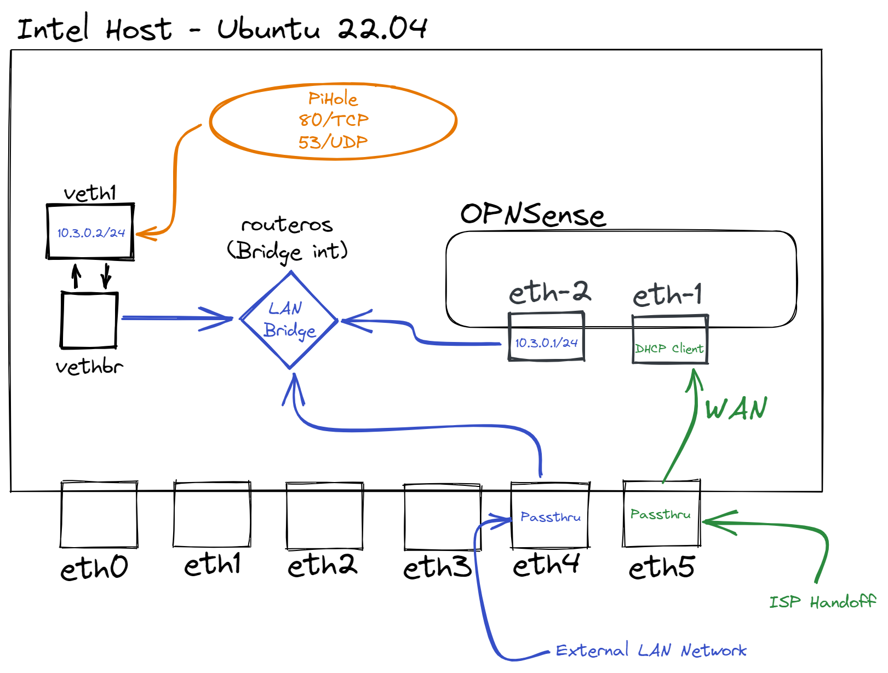
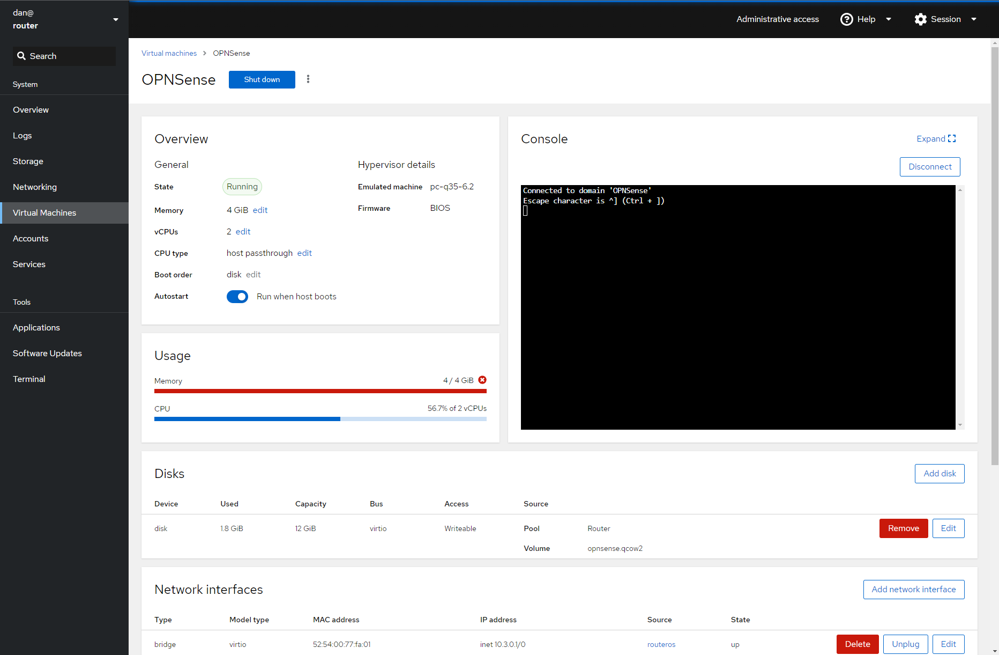
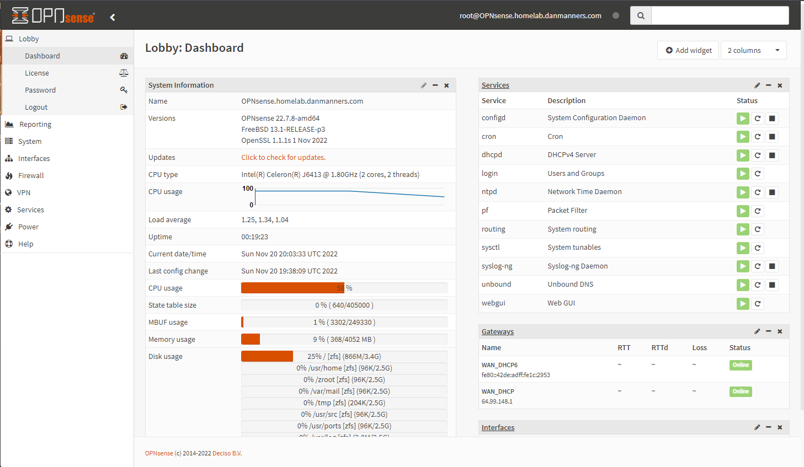

# Automated Home Router Nonsense

All of the code in here is for my absurdly dumb home router setup.

## Why is this even here?

I wanted to run my router _and_ Pi-hole on a single host. I purchased the [Intel J6413 HUNSN RJ09](https://www.amazon.com/dp/B0BCKVTTBQ) system, a small passively cooled NUC-alike box with six 2.5GbE ports. I didn't want to run Proxmox, because that's just a lot of complication. So I did something dumber: everything below.

## General Networking Architecture

I'm using PCIe passthrough on eth5 (`enp6s0`) for the OPNSense VM on the WAN interface, then passing the LAN interface to a network bridge (`routeros`), using a `veth` bridge (`veth1` and `vethbr`) to join to the local `routeros` network bridge, with a static IP on `veth1`, and eth4 (`enp5s0`) on the bridge to pass LAN back out to a physical interface. **ALL** of this is configured and managed via the [Netplan File](netplan.yaml) (stored at `/etc/netplan/00-installer-config.yaml`) and the [veth network configuration file](veth.netdev) (`/etc/systemd/network/01-veth.netdev`).

That's a mouthful, but it works. Check out this diagram; maybe it'll help.



## Tools, Libraries, and Applications (oh my)

- Ubuntu 22.04
- Cockpit
- Netplan
- Libvirt/KVM
- OPNSense
- Pi-hole

## Installing all of the packages

```bash
sudo apt install -y \
    qemu-kvm libvirt-daemon-system curl \
    libvirt-clients bridge-utils tar \
    zip cockpit cockpit-machines
```

## Enabling PCI Passthrough

Assuming you're using the same Intel hardware (or similar) that I am, you'll need to ensure that `Intel VT-D` is enabled in your bios. Then, edit your `/etc/default/grub` file and add:

```ini
GRUB_CMDLINE_LINUX_DEFAULT="intel_iommu=on"
```

Reboot your system and we're good to continue.

## Setting up the Virtual Machine

You'll want to `wget` the OPNSense Serial Installer and decompress the image file.

On the command line, you'll want to run something like this:

```bash
virt-install --name=OPNSense --description='Core Router' \
    --disk /var/lib/libvirt/images/OPNSense/OPNsense-22.7-OpenSSL-serial-amd64.img \
    --console pty,target_type=serial --osinfo linux2020 --ram=4096 --vcpus=2 \
    --import --graphics=none 
```

Then, through Cockpit (`https://hostip:9090`) you'll want to add a few other settings:

1. In `Virtual Machines` > `OPNSense`, scroll down to `Host devices` and click `add`
2. Switch to `PCI` and add the ethernet port you'll use for WAN. You can get this by running `lspci | grep Ethernet` on the server.
3. Remove the existing Network Interface
4. Add a new Network Interface.
    - **Interface type**: Direct attachment
    - **Source**: routeros
    - **Model**: virtio (Linux, perf)
    - **Persistence**: Always attach (checked)
5. Add a 10GB Disk we will install OPNSense to
6. Make sure to enable `Autostart`

Then, go through normally and install OPNSense with the credentials `installer`/`opnsense`.

At the end, your Cockpit should look something like this:



## OPNSense Configuration

If everything goes well, your OPNSense Router will be up and operational!



## Pi-Hole Installation and Configuration

While you could run Pi-Hole in a container, I'm not. Just run it from the `curl` instructions [off of their website](https://docs.pi-hole.net/main/basic-install/).

Then, you can point Pi-Hole Upstream DNS to wherever you want, and use OPNSense to the IP of the Ubuntu 22.04 server.
